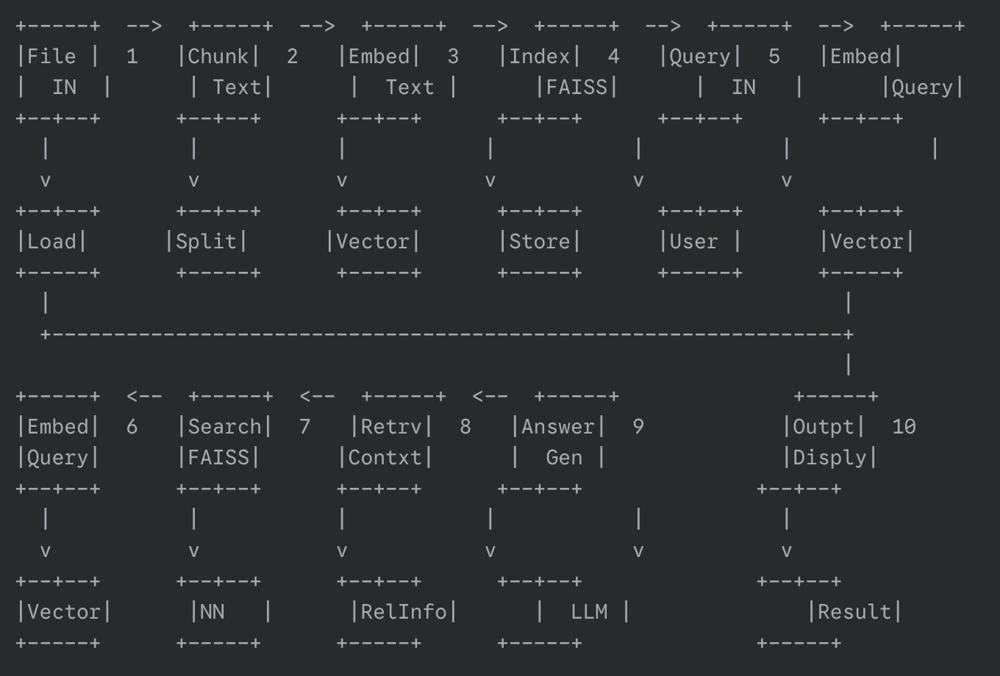

<div align="center">
    <h1>
    Government Scheme QnA using RAG
    </h1>
    <p>
    RGIPT Hackathon Project • Powered by Hugging Face, LangChain & Streamlit
    </p>

<a href="https://www.python.org/downloads/release/python-3110/">
    
</a>
<a href="https://pypi.org/project/streamlit/">
    
</a>
<a href="https://huggingface.co/sentence-transformers/all-MiniLM-L6-v2">
    
</a>
<a href="https://huggingface.co/mistralai/Mistral-7B-Instruct-v0.1">
    
</a>

</div>

---

## 📖 Overview

This project is a **Retrieval-Augmented Generation (RAG)** based intelligent QnA system that answers questions related to **Indian Government Schemes** by retrieving relevant policy documents and generating precise, context-rich answers using a large language model.

---

## ✨ Key Features

- 🔍 **Semantic Search** using FAISS + MiniLM embeddings  
- 🧠 **LLM-powered Answers** with `google/flan-t5-small`
- 📄 Supports `.json` and `.txt` based knowledge bases
- 🌐 **Streamlit Interface** for interactive Q&A
- 🔑 Hugging Face **API Key authentication** for secure model inference

---

<table align="center">
  <tr>
    <td align="center"><b>Streamlit Interface (insert screenshot here)</b><br></td>
  </tr>
  <tr>
    <td align="center"><b>RAG Pipeline Overview</b><br></td>
  </tr>
</table>

---

## ⚙️ Installation & Setup

### 📁 Clone the Repository
```bash
git clone https://github.com/theUtkarshRaj/Government-Scheme-QnA-using-RAG
cd government-scheme-rag-qa
```

### 🐍 Create and Activate Virtual Environment
```bash
# For macOS/Linux
python3 -m venv venv
source venv/bin/activate

# For Windows
python -m venv venv
venv\Scripts\activate
```

### 📦 Install Dependencies
```bash
pip install -r requirements.txt
```

### 📂 Add Knowledge Base Files
- Add `.txt` files inside the `/data` folder.
- `scheme_data.json` is already provided and used in the current setup.

---

## ▶️ Run the App

```bash
streamlit run main.py
```

> Go to [http://localhost:8501](http://localhost:8501) if the browser doesn't open automatically.

---

## 🔐 API Key Setup

After launching, enter your **Hugging Face API key** in the Streamlit sidebar.

**Steps:**

1. Go to [huggingface.co/settings/tokens](https://huggingface.co/settings/tokens)
2. Generate a new token (if not already created)
3. Paste it in the Streamlit input field

---

## 🧠 Models Used

| Component        | Model Name                                                 | Description                                 |
|------------------|------------------------------------------------------------|---------------------------------------------|
| Embeddings       | [`all-MiniLM-L6-v2`](https://huggingface.co/sentence-transformers/all-MiniLM-L6-v2) | Lightweight sentence transformer for retrieval |
| Language Model   | [`flan-t5-small`](https://api-inference.huggingface.co/models/google/flan-t5-small) | Instruction-tuned open LLM for generation |

---

## 💬 Sample Queries

> "What benefits are provided to women in this scheme?"  
> "Tell me about the financial support available under XYZ scheme."  
> "Is there any age restriction in this policy?"

---

## 📽️ Demo Video

[Click here to watch demo](https://drive.google.com/file/d/1R_av1NY1NSAGPCzrlX_lEw7_n7HkPl-m/view?usp=sharing)

---

## 👥 Team

| Name            | Role                  |
|----------------|-----------------------|
| [Utkarsh Raj](https://github.com/theUtkarshRaj) | Complete Development |

---

## 🙏 Acknowledgements

- [LangChain](https://www.langchain.com/)
- [Hugging Face Transformers](https://huggingface.co/)
- [SentenceTransformers](https://www.sbert.net/)
- [Streamlit](https://streamlit.io/)
- [FAISS](https://github.com/facebookresearch/faiss)

---

## 📜 License

This project is licensed under the **MIT License** – use freely with attribution!